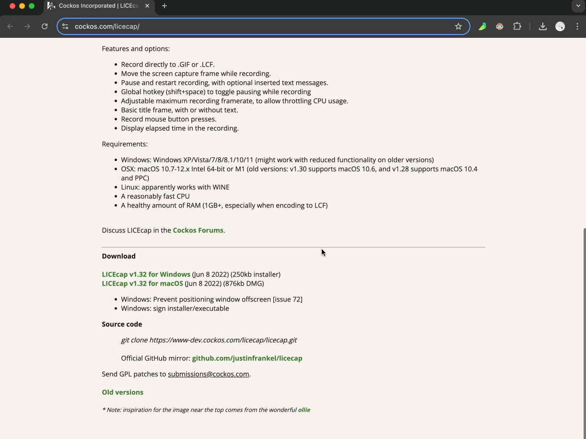

# [0001. 使用 LICEcap 在 macos 和 windows 系统上录制 gif 图](https://github.com/Tdahuyou/TNotes.notes/tree/main/notes/0001.%20%E4%BD%BF%E7%94%A8%20LICEcap%20%E5%9C%A8%20macos%20%E5%92%8C%20windows%20%E7%B3%BB%E7%BB%9F%E4%B8%8A%E5%BD%95%E5%88%B6%20gif%20%E5%9B%BE)

<!-- region:toc -->
- [1. 📒 LICEcap 简介](#1--licecap-简介)
- [2. 📒 LICEcap 的安装和使用步骤](#2--licecap-的安装和使用步骤)
  - [2.1. 安装](#21-安装)
  - [2.2. 使用步骤](#22-使用步骤)
- [3. 💻 使用 LICEcap 截 gif 图的效果展示](#3--使用-licecap-截-gif-图的效果展示)
<!-- endregion:toc -->

## 1. 📒 LICEcap 简介

- LICEcap 是一个非常流行且易于使用的免费工具，可以录制屏幕并保存为 GIF 格式。
- 特点：
  - 免费
  - macos、windows 均支持
  - 可配置录制参数
- LICEcap 实测可用，使用步骤也比较简单，可以在官方文档中点击 view a demo 来快速了解这玩意儿应该如何使用。
  - 

## 2. 📒 LICEcap 的安装和使用步骤

### 2.1. 安装

- 访问 [LICEcap 官方网站](https://www.cockos.com/licecap/) 下载 LICEcap。
  - 

### 2.2. 使用步骤

1. 打开 LICEcap。
2. 先选择你准备将录制好的 gif 图存放在什么位置，文件名叫什么。
3. 根据实际需要配置录制参数。
   1. 简单点直接使用默认的即可，不需要修改参数配置的值。
4. 将录制的框挪动到你需要录制的位置，点击开始录制，在录制完毕后点击 stop 结束即可。

## 3. 💻 使用 LICEcap 截 gif 图的效果展示

- 下面这是在不同操作系统 macos 和 Windows 中，使用 LICEcap 简单录制的 gif 图。
- Windows 环境：
  - 
- macOS 环境：
  - 
