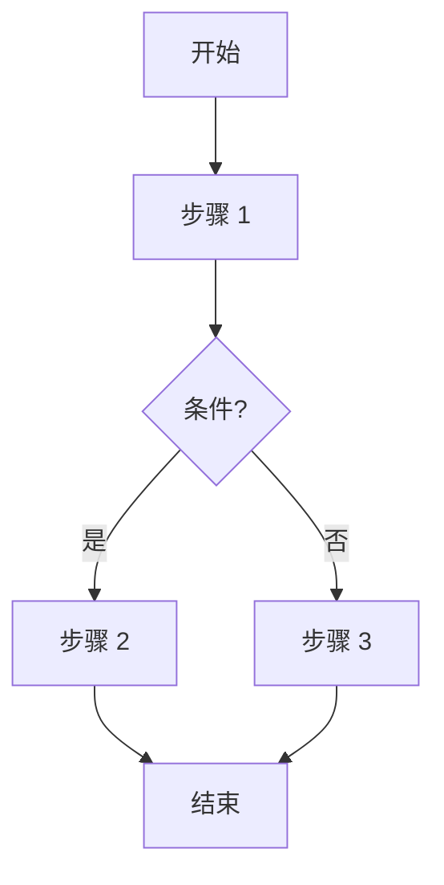
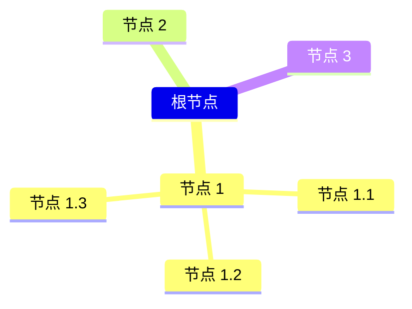

# [0025. mermaid 概述](https://github.com/tnotesjs/TNotes.notes/tree/main/notes/0025.%20mermaid%20%E6%A6%82%E8%BF%B0)

<!-- region:toc -->

- [1. 📝 概述](#1--概述)
- [2. 📒 认识 mermaid](#2--认识-mermaid)
- [3. 💻 通过 npm 安装 mermaid](#3--通过-npm-安装-mermaid)
- [4. 💻 通过 npm 安装 mermaid-cli](#4--通过-npm-安装-mermaid-cli)
- [5. 💻 demos.1 - 在网页中引入 mermaid](#5--demos1---在网页中引入-mermaid)
- [6. 🔗 References](#6--references)

<!-- endregion:toc -->

## 1. 📝 概述

- 概述
  - 这篇笔记对 mermaid 做了一个简单的介绍，并在 markdown 中使用 mermaid 绘制了几张图，需要知道在 markdown 中，我们是可以通过 mermaid 语法来实现文本绘图的，在必要的时候，可以直接在自己的 markdown 文档中手写图表。
- **Mermaid**
  - Mermaid 是一个用 JavaScript 编写的库，允许通过简单的文本语法生成多种图表（如流程图、甘特图、类图等）。
  - 它可集成于 Markdown、GitHub、GitLab、Confluence 等平台，且支持 CLI 工具将图表导出为图片文件。
  - 可通过 npm 安装到 Node.js 项目中，或直接嵌入网页以便实时渲染图表。

## 2. 📒 认识 mermaid

- **Mermaid 是一个用于生成图表和流程图的 JavaScript 库**。它允许你使用类似于 Markdown 的简单文本语法来定义图表，然后将其渲染成 **SVG 图形**。
- Mermaid 支持多种图表类型，包括：
  - 流程图（Flowcharts）
  - 时序图（Sequence diagrams）
  - 甘特图（Gantt charts）
  - 类图（Class diagrams）
  - 状态图（State diagrams）
  - 用户旅程图（User journey diagrams）
  - ER 图（Entity-Relationship diagrams）
  - 蜂巢图（Pie charts, also known as "pie" in Mermaid）
  - 等等……（甚至包括 mindmap 思维导图，不过目前（2024-10-27）支持效果一般）
    - 有关思维导图 mindmap 的写法，可以参考笔记：markdown.0005。
- Mermaid 的主要优点是它的简洁性和易用性，使得非技术人员也可以轻松创建复杂的图表。
- Mermaid 可以集成到许多文档系统中，如 **Markdown** 文件、GitHub READMEs、GitLab、Confluence 和其他支持 Markdown 的平台。
  - **Markdown 文档**：可以直接在 Markdown 文件中嵌入 Mermaid 代码块，而且写起来非常简单。
  - **GitHub**：可以在 GitHub 的 README 或其他 Markdown 文件中使用 Mermaid。
  - **GitLab**：GitLab 也支持 Mermaid 语法。
  - **Confluence**：Atlassian Confluence 提供了 Mermaid 插件。
  - **VS Code**：有多个 VS Code 扩展支持 Mermaid 语法高亮和预览。
- 流程图示例：下面是一个简单的 Mermaid 流程图
  - 这个示例定义了一个简单的流程图，其中包含一个开始节点、一个条件判断和两个可能的结果路径。

```
graph TD;
    A[开始] --> B[步骤 1]
    B --> C{条件?}
    C -- 是 --> D[步骤 2]
    C -- 否 --> E[步骤 3]
    D --> F[结束]
    E --> F
```



- 思维导图示例：

```
mindmap
根节点
  节点 1
    节点 1.1
    节点 1.2
    节点 1.3
  节点 2
  节点 3
```



## 3. 💻 通过 npm 安装 mermaid

- 如果使用的是 Node.js 项目，可以通过 npm 安装 Mermaid：

```sh
npm install mermaid
```

- 然后在 JavaScript 文件中引入并初始化 Mermaid：

```javascript
import mermaid from 'mermaid'

mermaid.initialize({ startOnLoad: true })
```

## 4. 💻 通过 npm 安装 mermaid-cli

- Mermaid 还提供了一个 CLI 工具，可以将 Mermaid 代码转换为图片文件或其他格式。你可以通过 npm 安装 CLI 工具：

```sh
npm install -g @mermaid-js/mermaid-cli
```

- 然后使用以下命令将 Mermaid 代码转换为图像：

```sh
mmdc -i diagram.mmd -o diagram.png
```

## 5. 💻 demos.1 - 在网页中引入 mermaid

```html
<!DOCTYPE html>
<html lang="en">
  <head>
    <meta charset="UTF-8" />
    <title>Mermaid Diagram</title>
    <script src="https://cdn.jsdelivr.net/npm/mermaid/dist/mermaid.min.js"></script>
  </head>
  <body>
    <div class="mermaid">graph TD; A-->B; A-->C; B-->D; C-->D;</div>
    <script>
      mermaid.initialize({ startOnLoad: true });
    </、script>
  </body>
</html>
```

- 最终效果：
  - 

## 6. 🔗 References

::: details

- https://github.com/mermaid-js/mermaid
  - github mermaid.js 源码仓库
- https://mermaid.js.org/
  - mermaid 官方文档。
- https://github.com/mermaid-js
  - github
  - mermaid js 社区

:::
