# [0027. Mindmap with Mermaid.js - 使用 mermaid 来绘制思维导图](https://github.com/Tdahuyou/TNotes.notes/tree/main/notes/0027.%20Mindmap%20with%20Mermaid.js%20-%20%E4%BD%BF%E7%94%A8%20mermaid%20%E6%9D%A5%E7%BB%98%E5%88%B6%E6%80%9D%E7%BB%B4%E5%AF%BC%E5%9B%BE)


<!-- region:toc -->
- [1. 🔗 YouTube - Mindmap with Mermaid.js](#1--youtube---mindmap-with-mermaidjs)
- [2. 🔗 mermaid 官方博客 - MermaidChart - 从混沌到清晰：使用 Mermaid.js 探索思维导图](#2--mermaid-官方博客---mermaidchart---从混沌到清晰使用-mermaidjs-探索思维导图)
- [3. 🔗 mermaid 官方博客 - mindmap 语法](#3--mermaid-官方博客---mindmap-语法)
- [4. 🔗 Font Awesome 5、Material Design Icons 图标库 - 可以在 mermaid.js 绘制的思维导图中插入图标](#4--font-awesome-5material-design-icons-图标库---可以在-mermaidjs-绘制的思维导图中插入图标)
- [5. 📒 缩进语法](#5--缩进语法)
- [6. 📒 节点形状 - 默认形状节点](#6--节点形状---默认形状节点)
- [7. 📒 节点形状 - 矩形节点](#7--节点形状---矩形节点)
- [8. 📒 节点形状 - 圆角矩形节点](#8--节点形状---圆角矩形节点)
- [9. 📒 节点形状 - 圆形节点](#9--节点形状---圆形节点)
- [10. 📒 节点形状 - 爆炸 💥 节点](#10--节点形状---爆炸--节点)
- [11. 📒 节点形状 - 云朵 ☁️ 节点](#11--节点形状---云朵-️-节点)
- [12. 📒 节点形状 - 六角形节点](#12--节点形状---六角形节点)
- [13. 📒 图标语法 - `::icon()` - 注：不好使](#13--图标语法---icon---注不好使)
- [14. 📒 图标的替代方案 - 使用 emoji](#14--图标的替代方案---使用-emoji)
- [15. 📒 样式语法 - `:::className` - 注：不好使](#15--样式语法---classname---注不好使)
- [16. 📒 Markdown Strings 特性](#16--markdown-strings-特性)
- [17. 💻 绘制思维导图测试](#17--绘制思维导图测试)
<!-- endregion:toc -->
 - 该笔记提供了 mermaid 思维导图的语法、缩进规则和节点形状，涵盖了如何通过不同的缩进表示层次关系及自定义节点形状（如矩形、圆形、云朵等）。
 - 补充了图标和样式的用法，但因集成限制，该功能效果不稳定，推荐使用 emoji 作为替代。
 - Markdown Strings 特性使得节点支持格式化文本及多行显示，进一步增强了思维导图的表现力。

## 1. 🔗 YouTube - Mindmap with Mermaid.js

- https://www.youtube.com/watch?v=dF9FAg73pQI

## 2. 🔗 mermaid 官方博客 - MermaidChart - 从混沌到清晰：使用 Mermaid.js 探索思维导图

- https://www.mermaidchart.com/blog/posts/from-chaos-to-clarity-exploring-mind-maps-with-mermaidjs/
  - mermaid 官方博客 - MermaidChart
  - From Chaos to Clarity: Exploring Mind Maps with MermaidJS
    - 译：从混沌到清晰：使用 Mermaid.js 探索思维导图

## 3. 🔗 mermaid 官方博客 - mindmap 语法

- https://mermaid.js.org/syntax/mindmap.html
  - mermaid 官方文档，这篇文档介绍的是如何使用 Mermaid 工具来创建思维导图（Mindmap）。

## 4. 🔗 Font Awesome 5、Material Design Icons 图标库 - 可以在 mermaid.js 绘制的思维导图中插入图标

- https://fontawesome.com/v5/search
  - Font Awesome 5 图标库
- https://pictogrammers.com/library/mdi/
  - Material Design Icons 图标库

## 5. 📒 缩进语法

- 缩进语法

```
mindmap
  Root
    A
      B
      C
```

- 或者下面这种形式

```
mindmap
Root
  A
    B
    C
```

- 最终渲染出来的效果如下

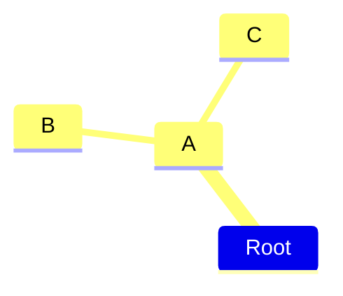

- 在思维导图中，节点之间的缩进用于表示层次关系。但是，具体的缩进量并不重要，重要的是相对缩进。
- Mermaid 会根据相对缩进来确定节点之间的关系。如果缩进不明确，Mermaid 会尝试通过已知的关系来补偿。
- 示例 - 假设我们有以下思维导图

```
mindmap
    Root
        A
            B
          C
```
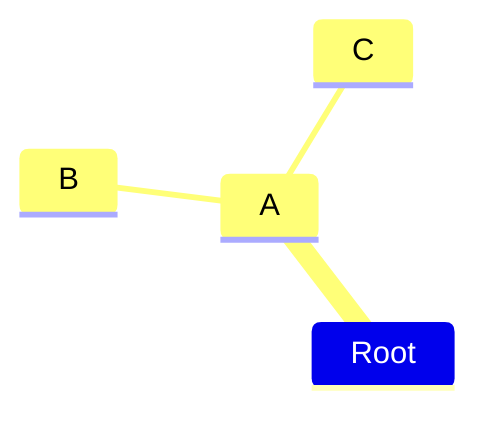

- 在这个示例中：
  - A 是 Root 的子节点。
  - B 是 A 的子节点。
  - C 的缩进介于 A 和 B 之间，导致层次关系不明确。
- 解释
  - 明确的关系：
    - B 明显是 A 的子节点，因为 B 的缩进比 A 大。
  - 不明确的关系：
    - C 的缩进比 B 小，但比 A 大。这使得 C 的层次关系不明确。
    - C 既不是 B 的子节点（因为它的缩进比 B 小），也不是 B 的同级节点（因为它的缩进不同）。
  - Mermaid 的处理方式：
    - Mermaid 会寻找最近的一个具有更小缩进的节点作为父节点。
    - 在这个例子中，A 是最近的一个具有更小缩进的节点。
    - 因此，Mermaid 会将 C 作为 A 的子节点，而不是 B 的子节点或兄弟节点。
- 如果想要表达的 —— C 是 B 的子节点，那么你可以这么写：

```
mindmap
    Root
        A
            B
                C
```
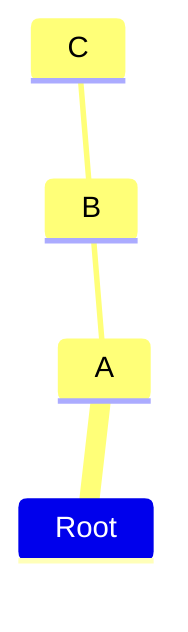

- 如果想要表达的 —— C 是 B 的兄弟节点，那么你可以这么写：

```
mindmap
    Root
        A
            B
            C
```

- 如果想要表达的 —— C 是 A 的兄弟节点，那么你可以这么写：

```
mindmap
    Root
        A
            B
        C
```
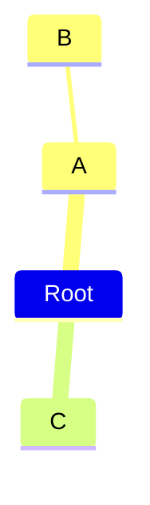


## 6. 📒 节点形状 - 默认形状节点

```
mindmap
  I am the default shape
```
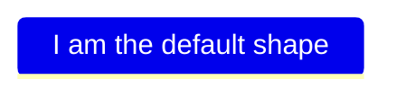

## 7. 📒 节点形状 - 矩形节点

```
mindmap
  id[I am a square]
```
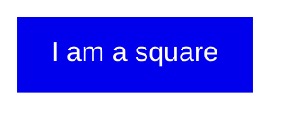

- 补充：在官方文档中，并没有提及在 mermaid 中的 id 有什么用，这里可以认为它其实没啥作用，写或者不写，最终渲染的结果都是一样的。因此在写的时候，只需要给节点包裹 `[]` 即可。
- 下面是删除 id 后的写法。

```
mindmap
  [I am a square]
```


## 8. 📒 节点形状 - 圆角矩形节点

```
mindmap
  (I am a rounded square)
```
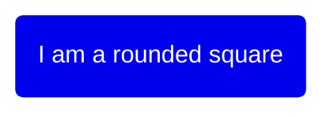

## 9. 📒 节点形状 - 圆形节点

```
mindmap
  ((I am a circle))
```
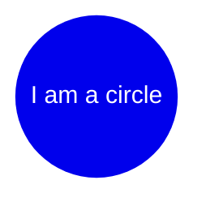

## 10. 📒 节点形状 - 爆炸 💥 节点

```
mindmap
  ))I am a bang((
```
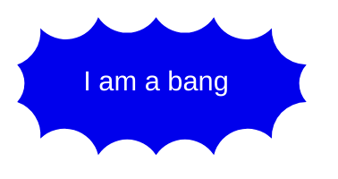

## 11. 📒 节点形状 - 云朵 ☁️ 节点

```
mindmap
  )I am a cloud(
```
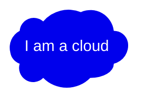

## 12. 📒 节点形状 - 六角形节点

```
mindmap
  {{I am a hexagon}}
```
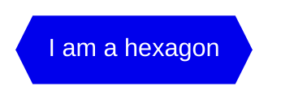

## 13. 📒 图标语法 - `::icon()` - 注：不好使

> As with flowcharts you can add icons to your nodes but with an updated syntax. The styling for the font based icons are added during the integration so that they are available for the web page. This is not something a diagram author can do but has to be done with the site administrator or the integrator. Once the icon fonts are in place you add them to the mind map nodes using the ::icon() syntax. You place the classes for the icon within the parenthesis like in the following example where icons for material design and Font Awesome 5 are displayed. The intention is that this approach should be used for all diagrams supporting icons. Experimental feature: This wider scope is also the reason Mindmaps are experimental as this syntax and approach could change.
> from: mermaid 官方文档。

> [!NOTE]
> 不建议使用 icon。
> 从官方的这一大段描述来看，大概就是在告诉我们，icon 这个功能，现在还不完善，存在一系列的问题。主要原因在于图标这玩意儿不好加，可能在编写文档的作者电脑上可以正常看到这些 icon（因为装了对应的图标库），但是在用户设备上，可能就无法正常显示了。而且有些图标可能可以正常展示，而有些图标或许又显示不了（这可能跟图标库的版本有关）。

- 图标字体的集成
  - 集成过程：图标字体的样式需要在网页集成过程中添加，以便在网页上可用。
  - 管理员或集成者操作：这一步骤通常由网站管理员或集成者完成，而不是图表作者。这意味着你需要确保你的网站或应用已经集成了所需的图标字体库（如 Material Design 或 Font Awesome 5）。
- 实验性功能
  - 实验性质：由于这种更广泛的图标支持是实验性的，因此语法和方法可能会在未来版本中发生变化。这也是为什么思维导图被标记为实验性功能的原因之一。
- **问：如何搜索图标？**
  - 进入下面的站点，找图标。
  - https://fontawesome.com/v5/search
    - Font Awesome 5 图标库
  - https://pictogrammers.com/library/mdi/
    - Material Design Icons 图标库
    - 比如想要添加一个房子的图标，搜索到了 home 是想要的，那么只需要在对应的节点后面加上 `::icon(mdi mdi-home)` 即可。
      - 如果是在 Font Awesome 5 图标库中找到的图标，将前缀 mdi 改为 fa 即可。
    - 

```
mindmap
  root((中心主题))
    I am a square::icon(fa fa-square)
    Another node::icon(mdi mdi-home)
    Child node
```
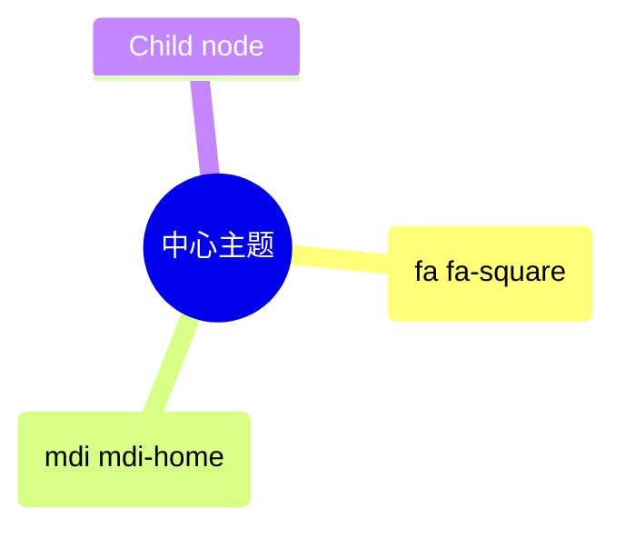
- **问：如果使用图标的话，可以正常渲染出来吗？**
  - 测试结果如下：
    - 下面的截图来自 mermaid 官方的渲染结果：
      - 
      - 这可能是我们想要的结果，官方站点或许集成了这些图标，打开站点的时候就把这些字体图标请求过来了。
    - 下面的截图来自 GitHub 上的渲染结果：
      - 
      - 两个图标都没法渲染，但是图标的位置是被保留了。
    - 下面的截图来自本地 VSCode 中的 markdown preview enhanced 插件的渲染结果：
      - 
      - 成功渲染了一个图标。
```
mindmap
  Root
    A
    ::icon(fa fa-book)
    B(B)
    ::icon(mdi mdi-skull-outline)
```
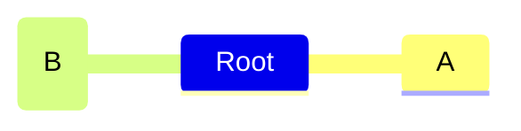

## 14. 📒 图标的替代方案 - 使用 emoji

```
mindmap
  Root
    房子 emoji 👉 🏠
```
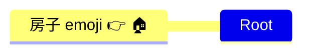

## 15. 📒 样式语法 - `:::className` - 注：不好使

- 和 icon 一样，需要站点集成，才能正常渲染。

```
mindmap
    Root
        A[A]
        :::urgent large
        B(B)
        C
```
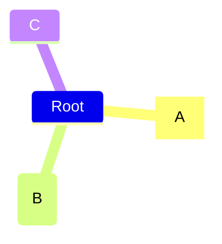

## 16. 📒 Markdown Strings 特性

- “Markdown Strings”特性，该特性增强了思维导图的功能，支持更多的文本格式选项，并且能够自动换行。
- Markdown Strings 特性
  - 增强功能：通过使用更灵活的字符串类型，支持文本格式化选项，如加粗和斜体。
  - 自动换行：自动处理标签内的文本换行，当文本过长时会自动换行。
  - 多行文本：允许在标签内直接使用换行符来创建多行文本。
- 代码示例：
```
mindmap
    id1["`**Root** with
a second line
Unicode works too: 🤓`"]
      id2["`The dog in **the** hog... a *very long text* that wraps to a new line`"]
      id3[Regular labels still works]
```
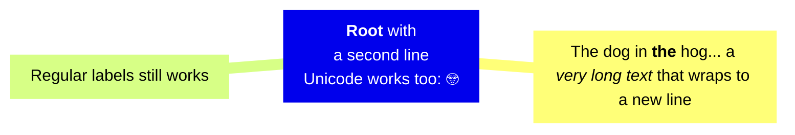
- 解释
  - id1：
    - `**Root**`：加粗显示 "Root"。
    - 多行文本：文本中包含换行符，可以显示多行文本。
    - Unicode 支持：例如表情符号 🤓 可以正常显示。
  - id2：
    - `**the**`：加粗显示 "the"。
    - `*very long text*`：斜体显示 "very long text"。
    - 自动换行：当文本过长时，会自动换行到下一行。
  - id3：
    - 普通标签：传统的标签仍然有效，不包含任何 Markdown 格式。
  - 注：上述 id1、id2、id3 仅仅是为了方便笔记记录，方便标注说明。即便删除 id1、id2、id3 它们，渲染结果依旧保持不变。

## 17. 💻 绘制思维导图测试

- 官方示例 1

```
mindmap
  )Goals for 2023(
    ))Family((
        Plan a trip together
        Call parents weekly
    ))Health((
        Less Carbs
        Gym
        Nature walks
    ))Career((
        Learn new skill
        Read more books
    ))Fun((
        Join Swim class
        Go to theatre plays
```

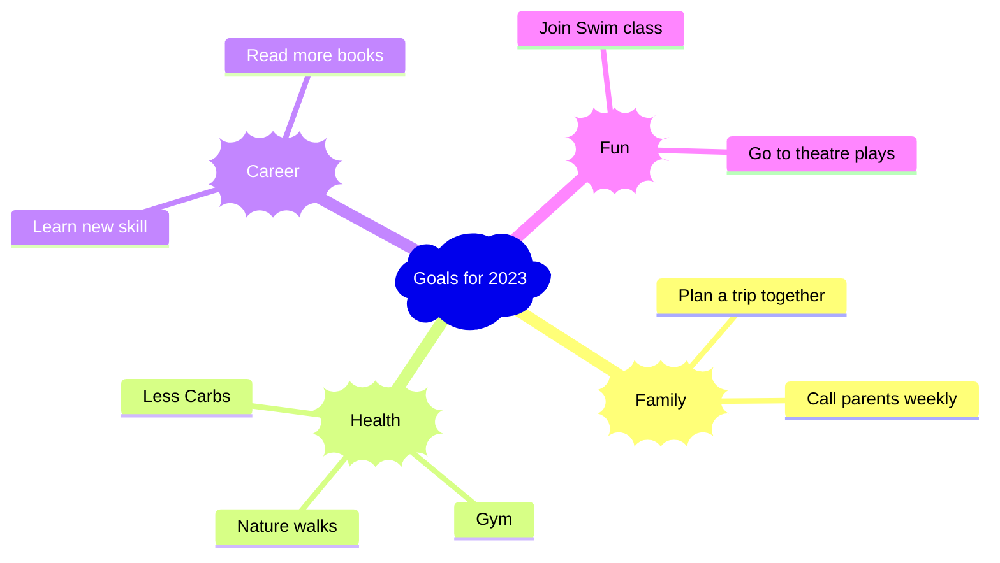

- 在 GitHub 上也是可以预览的，以下是在 VSCode 上预览的效果。
  - 
- 官方示例 2

```
mindmap
  root((mindmap))
    Origins
      Long history
      ::icon(fa fa-book)
      Popularisation
        British popular psychology author Tony Buzan
    Research
      On effectiveness<br/>and features
      On Automatic creation
        Uses
            Creative techniques
            Strategic planning
            Argument mapping
    Tools
      Pen and paper
      Mermaid
```

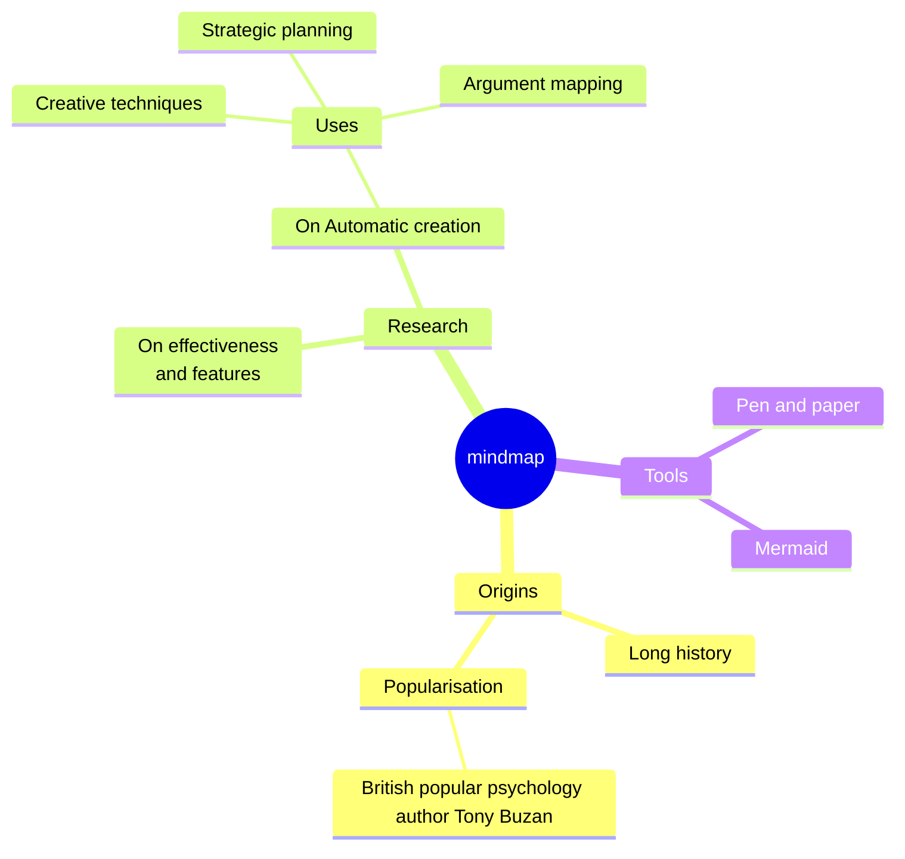

